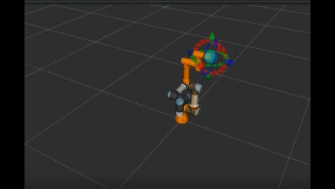

# Điều Khiển Robot UR3e Thực Hiện Quỹ Đạo Hình Tròn Với MoveIt 2 và Gazebo

## 1. Yêu cầu môi trường
- ROS 2: Humble Hawksbill
- MoveIt 2
- Mô phỏng Gazebo (Classic) cùng các gói `ur_simulation_gazebo`, `ur_moveit_config`

## 2. Cài đặt và Biên dịch
Clone repository vào thư mục `src` của ROS 2 workspace:

```bash
mkdir -p ~/ur_ws/src
cd ~/ur_ws/src
# Clone source code
git clone https://github.com/DOGDOT/control-ur3.git

# Cài đặt thư viện phụ thuộc và biên dịch
cd ~/ur_ws
rosdep update
rosdep install --ignore-src --from-paths src -y -r
colcon build --packages-select control-ur3
source install/setup.bash

# chạy chương trình
ros2 launch ur_viet_chu khoi_dong_viet_chu.launch.py
```
## 3. Kết quả chạy thực nghiệm

